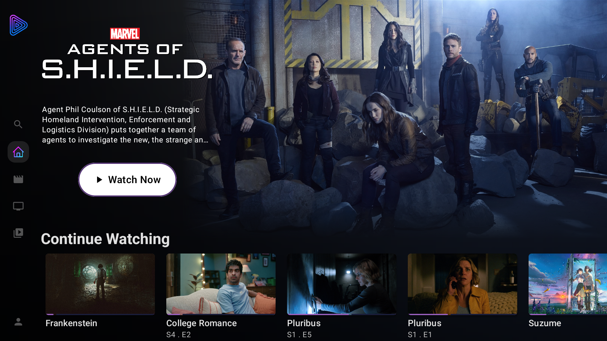
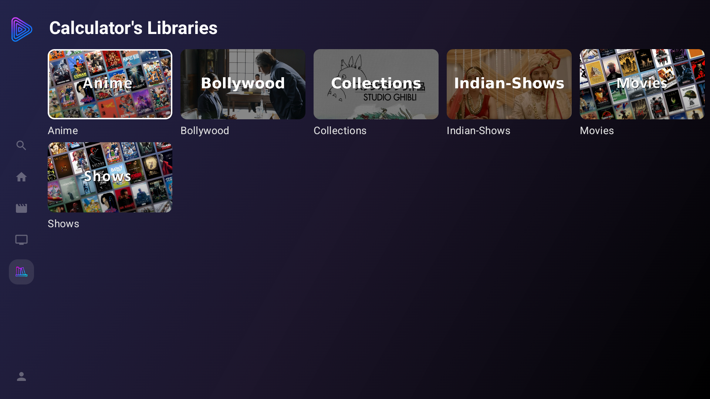
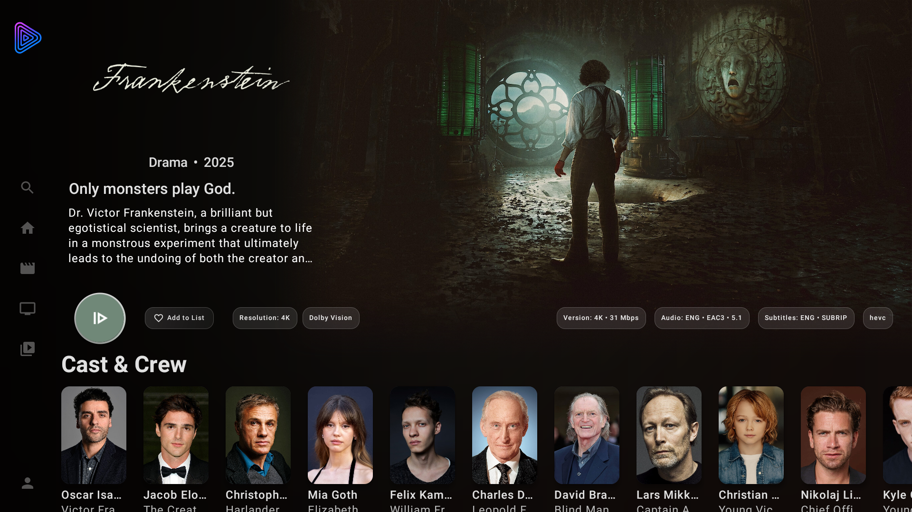
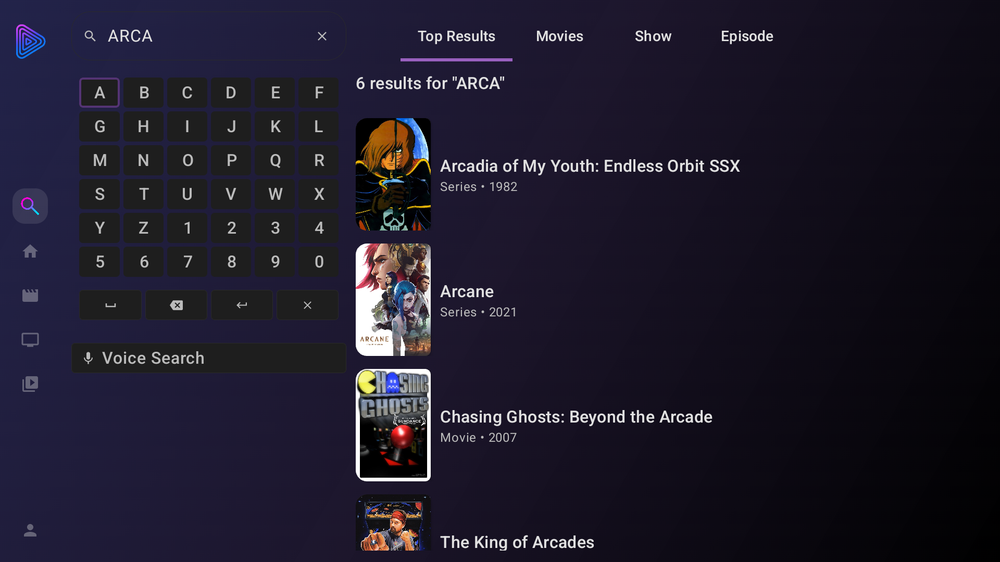
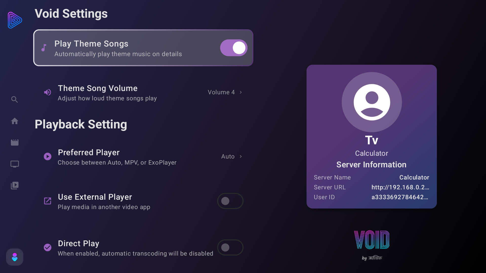
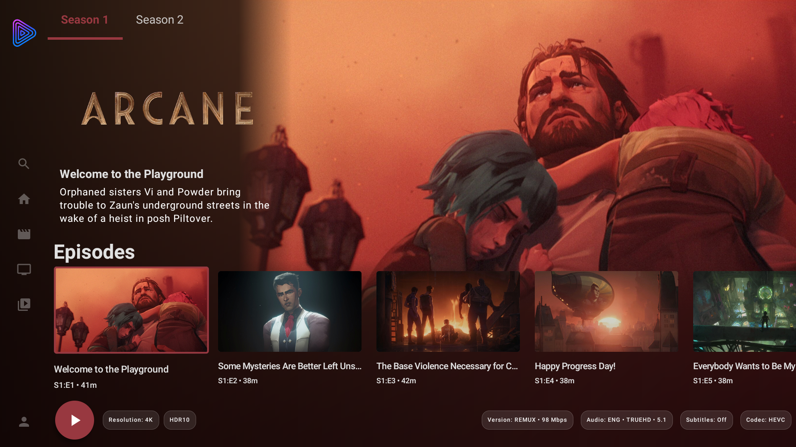
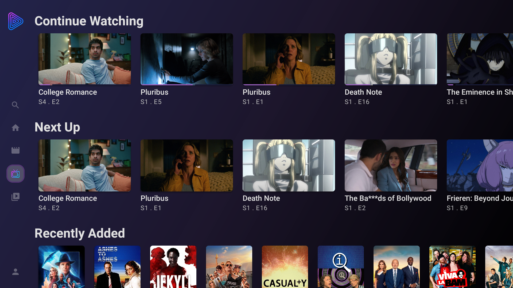

# 

**A modern, powerful, feature-rich client for Jellyfin**

Built entirely with **Kotlin** and **Jetpack Compose**

---

## ✨ Features

### Core Functionality
- **Better playback support** - With the help of MPV and Media3, Void can play almost anything.
- **Detailed media views** - See the version, HDR type (Dolby Vision/HDR10/HDR10+), and audio and subtitle codecs and languages on screen before starting playback.
- **Theme song support** - Immersive experience with the theme song playing in the background.
- **HDR fallback** - Option to turn off Dolby Vision if it is not supported by the device.
- **ASS subtitles support** - Thanks to MPV.
- **Hi10P hardware decoding support** - On Fire 4K and Max devices.
- **Skip intro support** - Using the media segment API.
- **Audio passthrough support** - Via Media3.
- **Quick login** - Faster login using a QR code.
- **Special features support** - Support for special features such as behind-the-scenes content, deleted scenes, etc.
- **Better multi-version support** - Prefers the current media folder for the next item, so it does not fall back to the default stream each episode (e.g. if you play episode 1 from folder B, the next episode will also play from folder B instead of A).
- **Remember audio and subtitles** - Remembers your audio and subtitle choices (e.g. if you use English subtitles with Japanese audio for episode 1, the next episode will also use English subtitles with Japanese audio instead of the default).
- **Collection support**

### Media Playback
- **MPV player** - High-quality video playback with extended format support, with the option to edit the MPV config to your preference.
- **ExoPlayer support** - Media3 with FFmpeg audio support.

### Modern UI/UX
- **Material 3 Design** - Beautiful, adaptive UI
- **Dynamic Themes** - Colours that adapt to your content
- **Responsive Layout** - Optimized for TV

### Advanced Features
- **Transcoding support** - Choose from Auto, 1080p, 720p.
- **Subtitle support** - Full subtitle support including ASS, with offset and size adjustment.
---

## Screenshots

| Home | Library | Library (Grid) | Movie |
|------|---------|----------------|-------|
|  |  |  |  |

| Search | Profile | Season | Movie Navigation |
|--------|---------|--------|------------------|
|  |  |  |  |

## Architecture

### Platform & Framework
- **Target SDK**: 35 (Android 14)
- **Minimum SDK**: 26 (Android 8.0)
- **Language**: Kotlin
- **UI Framework**: Jetpack Compose

### Core Libraries
- **Architecture**: Clean Architecture (Data/Domain/Presentation layers)
- **Dependency Injection**: Hilt
- **Async Programming**: Kotlin Coroutines + Flow
- **Navigation**: Navigation Compose
- **State Management**: ViewModel + StateFlow

### Storage & Persistence
- **Database**: Room
- **Preferences**: DataStore

### UI Components
- **Design System**: Material 3
- **Icons**: Material Icons + Some MIT licence icons
- **Responsive Design**: SDP/SSP Compose
- **Color Extraction**: Palette API

---

## Playback

### Player Settings
- **Primary Player**: MPV (recommended for best performance)
- **Fallback Player**: ExoPlayer with ffmpeg audio (better compatibility & HDR support)
- **Display Mode**: Fit Screen, Fill Screen, Original Size
- **Hardware Acceleration**: Enabled by default and automatically falls back to transcoding if it is not supported by the hardware.

### Streaming Settings
- **Direct Play**: When supported by the server and device.
- **Direct Play off**: Prefer hardware decoding; if not supported, fall back to transcoding.

---

## Acknowledgments

### Special Thanks
- **[Jellyfin Project](https://jellyfin.org/)** - For creating the amazing open-source media server.
- **Jellyfin Web and Kodi** - For inspiration and feature references.
- **[MPV](https://mpv.io/) & AndroidX Media3 teams** - For excellent media playback capabilities.
- **[@nitanmarcel](https://github.com/nitanmarcel)** - For the mpv-compose library that powers our video playback.
- **[jellyfin-androidx-media](https://github.com/jellyfin/jellyfin-androidx-media)** - For Media3 FFmpeg audio.

## ☕ Support the Project

If you find Void useful and want to support its development, consider buying me a coffee!

**Your support helps maintain and improve Void for everyone!**

---

## Collaborators

| [Hritwik Johri](https://github.com/hritwikjohri) | [KHazard](https://github.com/khazard) |
|:---:|:---:|
| Lead Developer | Contributor |

---

**Made with ❤️ by the Void Team**

[⭐ Star this repository](../../stargazers) | [🐛 Report Bug](../../issues) | [💡 Request Feature](../../issues)

---

## 📄 License

This project is licensed under the **GNU General Public License v3.0 (GPL-3.0)**.  
See `LICENSE` for the full licence text.
